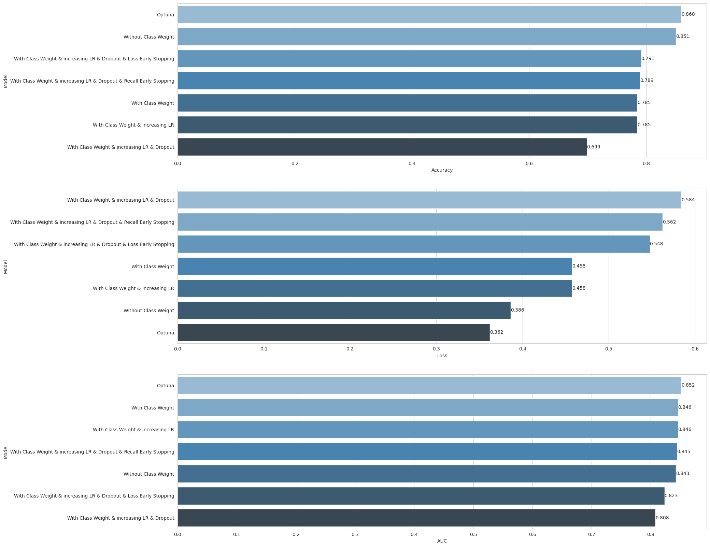

# Churn-Prediction-for-Bank-Customer

We have a dataset in which there are details of a bank's customers and the target variable is a binary variable reflecting the fact whether the customer left the bank (closed his account) or he continues to be a customer.

## The features in the given dataset are:

- <b>rownumber:</b>  Row Numbers from 1 to 10000.
- <b>customerid:</b>  A unique ID that identifies each customer.
- <b>surname:</b>  The customer’s surname.
- <b>creditscore:</b>  A credit score is a number between 300–850 that depicts a consumer's creditworthiness.
- <b>geography:</b>  The country from which the customer belongs to.
- <b>Gender:</b>  The customer’s gender: Male, Female
- <b>Age:</b>  The customer’s current age, in years, at the time of being customer.
- <b>tenure:</b>  The number of years for which the customer has been with the bank.
- <b>balance:</b>  Bank balance of the customer.
- <b>numofproducts:</b>  the number of bank products the customer is utilising.
- <b>hascrcard:</b> The number of credit cards given to the customer by the bank.
- <b>isactivemember:</b>  Binary Flag for indicating if the client is active or not with the bank before the moment where the client exits the company (recorded in the variable "exited")
- <b>exited:</b> Binary flag 1 if the customer closed account with bank and 0 if the customer is retained. 

# Tasks: ⚙️

#### 1. Import Libraries and Load Dataset

#### 2. Exploratory Data Analysis (EDA)

#### 3. Preprocessing of Data
- Train | Test Split, encoding and Scalling
  
#### 4. Modelling & Model Performance
-ANN without class weight
-ANN with class weight and increasing the learning rate
-ANN with class weight and increasing the learning rate and droupout 
-ANN with class weight and increasing the learning rate and droupout and loss early stopping
-ANN with class weight and increasing the learning rate and droupout and recall early stopping
-ANN with Optuna 

#### 4. Final Model and Model Deployment

## Used Libraries 📚
- `numpy`- `pandas`- `matplotlib`- `seaborn` - `sklearn`- `tensorflow` - `optuna` - `pickle`

  
## Run the project ⚙️
The repository includes a Jupyter notebook which you can run on your local machine or use this  link.

## Results 🪄

The above image demonstrates that the ANN with Optuna got good scores outperforming the other models.
Optimal Hyperparameters for Logistic Regression:

| Parameter    | Value   |
| :---: | :---: |
| n_units1   | `73`   |
| n_units2   | `61` |
| n_units3   | `124` |
| activation   | `'relu'` |
| optimizer   | `'Adam'` |
| learning_rate   | `0.019745594055152176` |
| w0   | `0.14477768557846568` |
| w0   | `0.26819196792311456` |

## Acknowledgements
This project is part of ML bootcamp provided by <a href="https://clarusway.com/"> Clarusway</a>.

